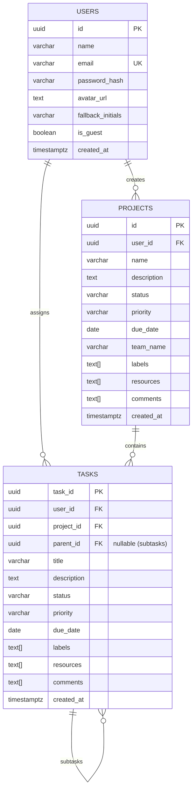

# 🚀 AbleSpace (Pyramid) — Full-Stack Project & Task Management Platform

[](https://nextjs.org/)
[](https://react.dev/)
[](https://nestjs.com/)
[](https://www.postgresql.org/)
[](https://www.typescriptlang.org/)
[](https://tailwindcss.com/)
[](https://firebase.google.com/)
[](https://vercel.com/)
[](https://railway.app/)

> **AbleSpace (Pyramid)** is an enterprise-grade project and hierarchical task management platform built with Next.js 15, NestJS, and PostgreSQL. Designed for engineering and product teams to track deadlines, organize multi-tiered task boards, collaborate via comments, and customize their workflow views in real time.

---

## 🌐 Live Deployments

- 🖥️ **Live Web Application (Vercel):** [https://able-space-mdg7.vercel.app](https://able-space-mdg7.vercel.app)
- ⚙️ **Live Backend API (Railway):** [https://ablespace-production-1346.up.railway.app/api](https://ablespace-production-1346.up.railway.app/api)
- 👤 **Instant Recruiter Access:** Use the **"Continue as Guest"** button or **"Login with Google"** for zero-friction exploration.

---

## 📸 Overview & Core Features

| Feature | Description |
| :--- | :--- |
| **Passwordless & Social Auth** | 1-click Google Sign-In via Firebase Auth alongside instant Guest Mode and Email/Password authentication. |
| **Multi-Level Hierarchy** | 3-tier recursive structure (`Project ➔ Task ➔ Subtask`) with status, priority, and deadline inheritance. |
| **Dark & Light Mode** | Seamless, accessible theme switching with persistent storage and zero layout shift. |
| **Search & Multi-Filter** | Real-time debounced text search across titles, teams, and tags with multi-faceted status, priority, and date filters. |
| **Detailed Entity Views** | Dedicated comprehensive detail view for Projects and Tasks featuring activity logs, comments, and resource links. |
| **Full Edit & Manage Engine** | In-place quick editing and modal updates for Projects, Tasks, and Subtasks with cascading relational cleanup. |

---

## 🚀 Feature Breakdown

### 1. 🔐 Passwordless & Flexible Authentication
- **Firebase Google OAuth:** One-click passwordless sign-in with automatic account creation and profile avatar synchronization in PostgreSQL.
- **Guest Session Mode:** Instant 1-click guest login for frictionless recruiter and reviewer exploration without credentials.
- **Traditional Email/Password:** Secure password hashing using `bcrypt` (10 salt rounds) and stateless JWT verification.
- **Decoupled Session Handling:** Client-side cookie bridge with `SameSite=None` / `Secure` support for cross-domain communication between Vercel and Railway.

### 2. 📋 Multi-Level Task Handling (`Project ➔ Task ➔ Subtask`)
- **Projects:** Top-level containers with statuses (`Backlog`, `To Do`, `In Progress`, `Completed`, `On Hold`), priority tags, assigned team, due date, resources, and labels.
- **Tasks:** Linked to parent projects with dedicated status, priority, and deadline tracking.
- **Subtasks:** Hierarchical tasks with `parent_id` self-referencing relationship, enabling granular sub-activity tracking within a parent task.

### 3. 🌓 Dark / Light Mode Support
- Full dark and light theme switching built with Tailwind CSS design tokens.
- Persists user theme preference across browser sessions without screen flickering or hydration mismatch.

### 4. 🔍 Search & Multi-Faceted Filtering
- **Real-Time Search:** Instant debounced search filtering by project/task title, team name, and assigned tags.
- **Combined Filter Engine:** Filter entities simultaneously by Status, Priority level, and "Due On or Before" dates.
- **Dynamic Column Customizer:** Customize visible table columns (Status, Priority, Team, Due Date) with `localStorage` persistence.

### 5. 📑 Detailed View for Projects & Tasks
- Unified `EntityDetailView` panel showcasing all metadata in an organized, collapsible layout.
- **Real-Time Comment Feed:** Add comments and discussions to any project or task.
- **Resource Management:** Attach documentation, reference URLs, and tags.
- **Activity Tracking:** Clear visual indicators of creation dates, author avatars, and status states.

### 6. ✏️ Full Editing Capabilities for Projects, Tasks & Subtasks
- **In-Place Quick Updates:** Update status and priority directly from dropdown selectors.
- **Comprehensive Edit Modals:** Edit title, description, team, labels, and due dates at any time.
- **Smart Date Clamping:** Task and subtask datepickers constrain maximum selectable date to parent project deadlines.
- **Database Trigger Validation:** PL/pgSQL database trigger (`check_task_due_date`) strictly validates date hierarchy on `INSERT` and `UPDATE`.

---

## 💡 Design Deviations & Architectural Decisions

To translate the static Figma wireframes into a fully functioning, production-grade application, several deliberate architectural and UX enhancements were implemented:

## 💡 Design Deviations & Architectural Decisions

To translate the static Figma wireframes into a fully functioning, production-grade application, several deliberate architectural and UX enhancements were implemented:

1. **Passwordless & Guest Authentication Experience:**
   - **Deviation / Addition:** The base mockup lacked a frictionless onboarding flow. Integrated **Firebase Google OAuth** for one-click passwordless sign-in (eliminating the need to remember credentials) alongside an **Instant Guest Mode** so evaluators and recruiters can test the entire platform without creating an account.
2. **Custom-Designed Modal Dialogs for Creation & Editing:**
   - **Deviation / Addition:** The Figma design only provided static board/view states without detailing the creation or editing UX. Visualized and engineered custom modal dialogs (`CreateEntityDialog`, edit views, date-pickers, label selectors) from scratch, ensuring they match the minimalist design system of the original mockups.
3. **Pragmatic Collaboration & RBAC Scoping:**
   - **Architectural Decision:** The Figma design featured visual hints of team collaboration (assignee avatars, team badges), but lacked concrete permission specifications. To deliver a rock-solid, production-tested, and bug-free core application within the delivery window, implemented a shared workspace model with team tagging and discussion threads, intentionally documenting complex enterprise RBAC permission matrices for future iterations.
4. **Comprehensive Toast Notification Engine (Sonner):**
   - **Deviation / Addition:** Replaced silent background updates and generic browser alerts with fluid, contextual toast messages for every user action (creation, updates, network errors, validation warnings, and deletion confirmations).
5. **Dual-Layer Hierarchical Date Validation:**
   - **Deviation / Addition:** Enforced date integrity at two levels — client-side date-pickers dynamically clamp maximum dates to the parent project's due date, and a PostgreSQL PL/pgSQL trigger (`check_task_due_date`) prevents invalid deadlines at the database engine level.
6. **Dynamic Column Visibility Customizer:**
   - **Deviation / Addition:** Added a "Fields" popover enabling users to customize and toggle table columns (Status, Priority, Team, Due Date), persisting preferences in `localStorage`.

---

## 🏗️ Tech Stack & Architecture

### **Frontend**
- **Framework:** Next.js 15 (App Router, Server & Client Components)
- **UI Library:** React 19, Tailwind CSS
- **State Management:** Zustand (with DevTools & Storage persistence)
- **Icons & Components:** Lucide React, Radix UI primitives
- **Forms & Validation:** React Hook Form
- **Auth Client:** Firebase Authentication SDK v10

### **Backend**
- **Framework:** NestJS (Node.js TypeScript framework)
- **Database Access:** `pg` (Node-Postgres connection pool with parameterized queries)
- **Security & Tokens:** `jsonwebtoken` (JWT), `bcrypt`, `cookie-parser`
- **Validation:** `class-validator`, `class-transformer`

### **Database & Infrastructure**
- **Database:** PostgreSQL 18 with `uuid-ossp` extensions & PL/pgSQL triggers
- **Hosting (Frontend):** Vercel (Global Edge Network)
- **Hosting (Backend & DB):** Railway (24/7 Containerized Services)

---

## 🗄️ Database Schema & Relational Design



### 🔗 Entity Relationships Explained
| Relationship | Cardinality | Description & Cascade Rules |
| :--- | :---: | :--- |
| **`USERS` ➔ `PROJECTS`** | **One-to-Many (`1:N`)** | **One user** can create and manage **many projects**. Each project is linked via `projects.user_id`. When a user account is deleted, all their projects are automatically deleted via `ON DELETE CASCADE`. |
| **`PROJECTS` ➔ `TASKS`** | **One-to-Many (`1:N`)** | **One project** contains **many tasks**. Each task references its parent project via `tasks.project_id`. Deleting a project automatically removes all associated tasks. |
| **`USERS` ➔ `TASKS`** | **One-to-Many (`1:N`)** | **One user** can author and be assigned to **many tasks**. Linked via `tasks.user_id` to track task creator and fallback avatar initials. |
| **`TASKS` ➔ `TASKS`** | **Self-Referencing (`1:N`)** | **One parent task** can contain **many subtasks**. Subtasks store their parent's ID in `tasks.parent_id`. Top-level tasks have `parent_id = NULL`. Deleting a parent task automatically deletes all its nested subtasks. |

---

### 🔗 Entity Relationships Explained

| Relationship | Cardinality | Description & Cascade Rules |
| :--- | :---: | :--- |
| **`USERS` ➔ `PROJECTS`** | **One-to-Many (`1:N`)** | **One user** can create and manage **many projects**. Each project is linked via `projects.user_id`. When a user account is deleted, all their projects are automatically deleted via `ON DELETE CASCADE`. |
| **`PROJECTS` ➔ `TASKS`** | **One-to-Many (`1:N`)** | **One project** contains **many tasks**. Each task references its parent project via `tasks.project_id`. Deleting a project automatically removes all associated tasks. |
| **`USERS` ➔ `TASKS`** | **One-to-Many (`1:N`)** | **One user** can author and be assigned to **many tasks**. Linked via `tasks.user_id` to track task creator and fallback avatar initials. |
| **`TASKS` ➔ `TASKS`** | **Self-Referencing (`1:N`)** | **One parent task** can contain **many subtasks**. Subtasks store their parent's ID in `tasks.parent_id`. Top-level tasks have `parent_id = NULL`. Deleting a parent task automatically deletes all its nested subtasks. |

---

### 🛡️ PostgreSQL Date Validation Trigger

#### Business Logic:
A task or subtask **must never have a deadline later than the parent project's deadline**. While the frontend UI date-picker clamps the maximum selectable date, this PostgreSQL trigger guarantees that business logic cannot be violated at the database layer.

```sql
CREATE OR REPLACE FUNCTION check_task_due_date() RETURNS trigger AS $$
DECLARE
    project_due DATE;
BEGIN
    -- 1. Fetch parent project due date
    SELECT due_date INTO project_due FROM projects WHERE id = NEW.project_id;
    
    -- 2. Validate task deadline against project deadline
    IF project_due IS NOT NULL AND NEW.due_date IS NOT NULL AND NEW.due_date > project_due THEN
        RAISE EXCEPTION 'Task due date (%) cannot exceed project due date (%)', NEW.due_date, project_due;
    END IF;
    
    RETURN NEW;
END;
$$ LANGUAGE plpgsql;

-- 3. Trigger executes before any INSERT or UPDATE on tasks
CREATE TRIGGER validate_task_due_date_trigger 
BEFORE INSERT OR UPDATE ON tasks 
FOR EACH ROW EXECUTE FUNCTION check_task_due_date();
```

#### How the Trigger Works:
1. **Trigger Interception:** Runs automatically on `BEFORE INSERT` or `BEFORE UPDATE` on any row in the `tasks` table.
2. **Querying Parent Scope:** Looks up the parent project's `due_date` using `NEW.project_id`.
3. **Condition Check:** If `NEW.due_date > project_due`, PostgreSQL immediately aborts the transaction and throws a descriptive exception.
4. **Data Integrity:** Protects the database from invalid date scheduling across all API clients.

---

## 📂 Project Folder Structure

```text
AbleSpace/
├── backend/                        # NestJS REST API Server
│   ├── sql/
│   │   └── schema.sql              # Database DDL, tables & trigger functions
│   ├── src/
│   │   ├── auth/                   # Authentication Module (Firebase OAuth, JWT, Guest)
│   │   │   ├── dto/
│   │   │   │   ├── firebase-login.dto.ts
│   │   │   │   ├── login.dto.ts
│   │   │   │   └── register.dto.ts
│   │   │   ├── interfaces/
│   │   │   │   └── user-row.interface.ts
│   │   │   ├── auth.controller.ts  # Auth endpoints (/api/auth)
│   │   │   ├── auth.module.ts
│   │   │   ├── auth.service.ts     # Password hashing & token issuance
│   │   │   └── jwt-auth.guard.ts   # Route guard & cookie verification
│   │   ├── database/               # PostgreSQL Connection Module
│   │   │   ├── database.module.ts
│   │   │   └── database.service.ts # Parameterized SQL query executor
│   │   ├── projects/               # Projects Management Module
│   │   │   ├── dto/
│   │   │   │   ├── add-comment.dto.ts
│   │   │   │   ├── create-project.dto.ts
│   │   │   │   └── update-project.dto.ts
│   │   │   ├── projects.controller.ts
│   │   │   ├── projects.module.ts
│   │   │   └── projects.service.ts
│   │   ├── tasks/                  # Tasks & Subtasks Management Module
│   │   │   ├── dto/
│   │   │   │   ├── create-task.dto.ts
│   │   │   │   └── update-task.dto.ts
│   │   │   ├── tasks.controller.ts
│   │   │   ├── tasks.module.ts
│   │   │   └── tasks.service.ts
│   │   ├── app.controller.spec.ts
│   │   ├── app.controller.ts
│   │   ├── app.module.ts           # Root application module
│   │   ├── app.service.ts
│   │   └── main.ts                 # Bootstrap, CORS, cookie-parser & pipes
│   ├── test/                       # E2E Testing Suite
│   │   ├── app.e2e-spec.ts
│   │   └── jest-e2e.json
│   ├── .env
│   ├── .gitignore
│   ├── .prettierrc
│   ├── eslint.config.mjs
│   ├── nest-cli.json
│   ├── package.json
│   ├── tsconfig.build.json
│   └── tsconfig.json
│
├── frontend/                       # Next.js 15 Frontend
│   ├── api/                        # Axios API Client & Endpoints
│   │   ├── auth/                   # Auth endpoints (login, register, firebase, me)
│   │   ├── projects/               # Projects endpoints (CRUD, comments, labels)
│   │   └── tasks/                  # Tasks & Subtasks endpoints (CRUD, subtasks)
│   ├── app/                        # App Router Pages & Layouts
│   │   ├── (auth)/                 # Public Authentication Route Group
│   │   │   ├── login/              # Login page (/login)
│   │   │   └── register/           # Register page (/register)
│   │   ├── (dashboard)/            # Protected Dashboard Route Group
│   │   │   └── dashboard/
│   │   │       ├── projects/       # Projects Board (/dashboard/projects)
│   │   │       │   └── [projectId]/# Dynamic Project Detail (/dashboard/projects/:id)
│   │   │       ├── tasks/          # Tasks Board (/dashboard/tasks)
│   │   │       │   └── [taskId]/   # Dynamic Task Detail (/dashboard/tasks/:id)
│   │   │       └── settings/       # User Settings (/dashboard/settings)
│   │   ├── favicon.ico
│   │   ├── globals.css             # Tailwind base styles & color tokens
│   │   └── layout.tsx              # Root layout & providers
│   ├── components/                 # Component Library
│   │   ├── common/                 # Shared Components (Sidebar, Popovers, Dialogs)
│   │   │   ├── Dashboard/          # EntityDetailView sliding layout
│   │   │   └── Dialog/             # CreateEntityDialog dynamic modal
│   │   ├── features/               # Domain-Specific Boards (ProjectsBoard, TaskBoard)
│   │   └── ui/                     # Primitives (Table, Card, Button, Avatar, Dialog, etc.)
│   ├── context/                    # React Contexts (SidebarContext.tsx)
│   ├── hooks/                      # Custom Hooks (useGoogleAuth.ts, useAuth.ts)
│   ├── lib/                        # Utilities & Firebase client config (firebase.ts, utils.ts)
│   ├── public/                     # Static media & assets
│   ├── store/                      # Zustand Global State Management
│   │   ├── slices/                 # Modular State Slices
│   │   │   ├── authSlice.ts        # User authentication & session state
│   │   │   ├── projectSlice.ts     # Projects state & active selection
│   │   │   └── taskSlice.ts        # Tasks, subtasks & filtering state
│   │   └── useAppStore.ts          # Central combined Zustand store
│   ├── types/                      # TypeScript definitions (entity.types.ts)
│   ├── .env
│   ├── .gitignore
│   ├── components.json             # Shadcn / Radix configuration
│   ├── eslint.config.mjs
│   ├── middleware.ts               # Route protection & auth verification
│   ├── next.config.ts
│   ├── package.json
│   ├── postcss.config.mjs
│   ├── tailwind.config.ts
│   └── tsconfig.json
```

---

## 💻 Local Development Setup

### Prerequisites
- [Node.js](https://nodejs.org/) (v18 or higher)
- [PostgreSQL](https://www.postgresql.org/) (v14 or higher)
- Git

---

### Step 1: Clone Repository
```bash
git clone https://github.com/RajGuptaVips2025/AbleSpace.git
cd AbleSpace
```

---

### Step 2: Backend Setup
```bash
cd backend
npm install
```

Create a `.env` file in the `backend/` directory:
```env
PORT=""
DB_HOST=""
DB_PORT=""
DB_USER=""
DB_PASSWORD=""
DB_NAME=""
JWT_SECRET=""
NODE_ENV=development
```

Initialize your PostgreSQL database and start the backend:
```bash
npm run start:dev
```
Backend API will be live on `http://localhost:8000/api`.

---

### Step 3: Frontend Setup
```bash
cd ../frontend
npm install
```

Create a `.env.local` file in the `frontend/` directory:
```env
NEXT_PUBLIC_API_URL=http://localhost:8000/api

# Firebase Web Config
NEXT_PUBLIC_FIREBASE_API_KEY=your_api_key
NEXT_PUBLIC_FIREBASE_AUTH_DOMAIN=your_project.firebaseapp.com
NEXT_PUBLIC_FIREBASE_PROJECT_ID=your_project_id
NEXT_PUBLIC_FIREBASE_STORAGE_BUCKET=your_project.firebasestorage.app
NEXT_PUBLIC_FIREBASE_MESSAGING_SENDER_ID=your_sender_id
NEXT_PUBLIC_FIREBASE_APP_ID=your_app_id
```

Start the Next.js dev server:
```bash
npm run dev
```
Open [http://localhost:3000](http://localhost:3000) in your browser!

---

## 🔮 Scope for Future Improvements

- ⚡ **Real-Time WebSockets (Socket.io / SSE):** Live multi-user cursor tracking and board updates when collaborators modify tasks.
- 📊 **Kanban Drag-and-Drop View:** Drag cards between status lanes using `@hello-pangea/dnd` or `@dnd-kit`.
- 📎 **Direct Cloud File Attachments:** S3 / Cloudinary integration for uploading image screenshots and PDF documentation directly to tasks.
- 👥 **Team Workspaces & RBAC:** Multi-tenant workspace creation with Admin, Member, and Viewer role-based permissions.
- 📈 **Productivity Analytics & Burn-down Charts:** Visual metrics on completed tasks, weekly velocity, and overdue items.

---

## 👨‍💻 Author

**Raj Gupta**
- **GitHub:** [@RajGuptaVips2025](https://github.com/RajGuptaVips2025)
- **Live Demo:** [AbleSpace on Vercel](https://able-space-mdg7.vercel.app)
