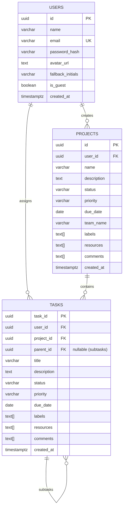

# 🚀 AbleSpace (Pyramid) — Full-Stack Project & Task Management Platform

[](https://nextjs.org/)
[](https://react.dev/)
[](https://nestjs.com/)
[](https://www.postgresql.org/)
[](https://www.typescriptlang.org/)
[](https://tailwindcss.com/)
[](https://firebase.google.com/)
[](https://vercel.com/)
[](https://railway.app/)

> **AbleSpace (Pyramid)** is an enterprise-grade project and hierarchical task management platform built with Next.js 15, NestJS, and PostgreSQL. Designed for engineering and product teams to track deadlines, organize multi-tiered task boards, collaborate via comments, and customize their workflow views in real time.

---

## 🌐 Live Deployments

- 🖥️ **Live Web Application (Vercel):** [https://able-space-mdg7.vercel.app](https://able-space-mdg7.vercel.app)
- ⚙️ **Live Backend API (Railway):** [https://ablespace-production-1346.up.railway.app/api](https://ablespace-production-1346.up.railway.app/api)
- 👤 **Instant Recruiter Access:** Use the **"Continue as Guest"** button or **"Login with Google"** for zero-friction exploration.

---

## 📸 Overview & Key Highlights

| Feature | Description |
| :--- | :--- |
| **Hierarchical Task Trees** | Projects contain tasks, and tasks can have nested subtasks with progress tracking. |
| **Smart Deadline Clamping** | UI date-pickers and database triggers strictly enforce that task deadlines cannot exceed parent project deadlines. |
| **Tri-Mode Authentication** | Google OAuth via Firebase, Email/Password (Bcrypt + JWT), and 1-click Guest Sessions. |
| **Dynamic View Customizer** | Toggle table column visibility with persistent storage and multi-faceted search/filters. |
| **Theme & Color Customization** | Light/Dark theme switching with 6 accent color modes (Amber, Blue, Pink, Rose, Emerald, Black). |
| **Discussions & Activity Logs** | Real-time comment feeds, creator attribution, and automatic status/priority update records. |

---

## 🚀 Feature Breakdown

### 1. 🏢 Project Management
- Full CRUD operations with detailed metadata: Name, Description, Status (`Backlog`, `To Do`, `In Progress`, `Completed`, `On Hold`), Priority (`Urgent`, `High`, `Medium`, `Low`, `No Priority`), Team Name, Due Date, Documentation Links, and Labels (max 5 tags).
- Summary statistics and dedicated project detailed view with nested task boards.

### 2. 📋 Hierarchical Task & Subtask Tracking
- Tasks linked directly to parent projects with status, priority, and assignee metadata.
- First-class Subtask support (`parent_id` self-referencing relationship) allowing deep hierarchy.
- Interactive status popovers and quick-edit dropdowns.

### 3. 🛡️ Smart Date Hierarchy & Validation
- **Frontend Clamping:** The task creation date picker dynamically constrains `maxDate` to the parent project's due date, preventing accidental scheduling beyond project scope.
- **Database Integrity (PL/pgSQL Trigger):** A PostgreSQL database trigger (`validate_task_due_date_trigger`) executes before `INSERT` or `UPDATE` on the `tasks` table to guarantee that task deadlines never exceed project deadlines at the database engine level.

### 4. 🔐 Robust Authentication System
- **Google OAuth (Firebase):** One-click sign-in synchronized with the PostgreSQL database.
- **Email & Password:** Secure password hashing using `bcrypt` (10 salt rounds) with JWT authorization.
- **Guest Access Mode:** 1-click ephemeral session allowing instant preview without credentials.
- **Cross-Domain Session Management:** Production cookies configured with `SameSite=None`, `Secure`, and client-side fallback synchronization for decoupled frontend/backend hosting.

### 5. 🔍 Interactive Search, Filters & Field Customizer
- **Instant Search:** Debounced multi-field search across title, team name, and labels.
- **Filters:** Combined filtering by Status, Priority, and "Due On or Before" date ranges.
- **Column Customizer:** Show/hide Status, Priority, Team, and Due Date columns with `localStorage` persistence.

### 6. 🎨 Personalized UI/UX & Theming
- Fully responsive sidebar layout with backdrop blur overlay on mobile screens.
- **Theme Switcher:** Seamless Dark / Light mode toggling.
- **Color Palette Modes:** 6 visual accents (Amber, Blue, Pink, Rose, Emerald, Black).

---

## 💡 Design Deviations & Value-Add Enhancements

Beyond the baseline requirements, the following architectural and UX enhancements were implemented:

1. **Dual-Layer Deadline Integrity:** 
   - Instead of relying solely on frontend form checks, a database-level PL/pgSQL trigger was implemented in PostgreSQL (`check_task_due_date()`) to ensure absolute data consistency even if API endpoints are called externally.
2. **Dynamic Column Visibility Engine:**
   - Added a "Fields" popover enabling users to customize their table view, storing preferences in `localStorage` per device.
3. **Decoupled Production Architecture:**
   - Architected as an independent frontend (Vercel Serverless Edge) and backend (Railway PostgreSQL + NestJS) with cross-origin cookie security and CORS safeguards.
4. **Enhanced Color Mode Customizer:**
   - Expanded the user profile settings to include live accent color swatches matching modern design systems.
5. **Cascading Relational Integrity (`ON DELETE CASCADE`):**
   - Deleting a project automatically cleans up all associated tasks, subtasks, and updates, preventing orphaned database records.
6. **Non-Blocking Toast Feedback:**
   - Replaced default alert popups with fluid, animated notifications using `Sonner`.

---

## 🏗️ Tech Stack & Architecture

### **Frontend**
- **Framework:** Next.js 15 (App Router, Server & Client Components)
- **UI Library:** React 19, Tailwind CSS
- **State Management:** Zustand (with DevTools & Storage persistence)
- **Icons & Components:** Lucide React, Radix UI primitives
- **Forms & Validation:** React Hook Form
- **Auth Client:** Firebase Authentication SDK v10

### **Backend**
- **Framework:** NestJS (Node.js TypeScript framework)
- **Database Access:** `pg` (Node-Postgres connection pool with parameterized queries)
- **Security & Tokens:** `jsonwebtoken` (JWT), `bcrypt`, `cookie-parser`
- **Validation:** `class-validator`, `class-transformer`

### **Database & Infrastructure**
- **Database:** PostgreSQL 18 with `uuid-ossp` extensions & PL/pgSQL triggers
- **Hosting (Frontend):** Vercel (Global Edge Network)
- **Hosting (Backend & DB):** Railway (24/7 Containerized Services)

---

## 🗄️ Database Schema & Relational Design



### PostgreSQL Date Validation Trigger:
```sql
CREATE OR REPLACE FUNCTION check_task_due_date() RETURNS trigger AS $$
DECLARE
    project_due DATE;
BEGIN
    SELECT due_date INTO project_due FROM projects WHERE id = NEW.project_id;
    IF project_due IS NOT NULL AND NEW.due_date IS NOT NULL AND NEW.due_date > project_due THEN
        RAISE EXCEPTION 'Task due date (%) cannot exceed project due date (%)', NEW.due_date, project_due;
    END IF;
    RETURN NEW;
END;
$$ LANGUAGE plpgsql;

CREATE TRIGGER validate_task_due_date_trigger 
BEFORE INSERT OR UPDATE ON tasks 
FOR EACH ROW EXECUTE FUNCTION check_task_due_date();
```

---

## 📂 Project Folder Structure

```text
AbleSpace/
├── backend/                        # NestJS REST API Server
│   ├── src/
│   │   ├── auth/                   # Authentication module (JWT, Firebase, Guest)
│   │   │   ├── dto/                # Request validation DTOs
│   │   │   ├── auth.controller.ts  # Auth routes (/api/auth)
│   │   │   ├── auth.service.ts     # Business logic & token generation
│   │   │   └── jwt-auth.guard.ts   # Route guard & cookie verification
│   │   ├── database/               # PostgreSQL pool connection service
│   │   ├── projects/               # Projects CRUD module
│   │   ├── tasks/                  # Tasks & Subtasks CRUD module
│   │   ├── app.module.ts           # Root application module
│   │   └── main.ts                 # Bootstrap, CORS & global pipes
│   ├── package.json
│   └── tsconfig.json
│
├── frontend/                       # Next.js 15 Frontend
│   ├── app/                        # App Router Pages
│   │   ├── (auth)/                 # Login & Register routes
│   │   ├── (dashboard)/            # Protected dashboard & project views
│   │   └── layout.tsx              # Root HTML & theme provider
│   ├── components/
│   │   ├── common/                 # Reusable components (Sidebar, Popovers, Dialogs)
│   │   │   ├── Dashboard/          # Shared EntityDetailView layout
│   │   │   └── Dialog/             # CreateEntityDialog form engine
│   │   ├── features/               # Domain components (ProjectsBoard, TaskBoard)
│   │   └── ui/                     # Primitives (Table, Card, Button, Avatar, etc.)
│   ├── hooks/                      # Custom React hooks (useGoogleAuth, useAuth)
│   ├── lib/                        # Firebase & utility configurations
│   ├── store/                      # Zustand store & slices (authSlice, projectSlice)
│   ├── middleware.ts               # Route protection & cookie validation
│   ├── package.json
│   └── tailwind.config.ts
└── README.md
```

---

## 💻 Local Development Setup

### Prerequisites
- [Node.js](https://nodejs.org/) (v18 or higher)
- [PostgreSQL](https://www.postgresql.org/) (v14 or higher)
- Git

---

### Step 1: Clone Repository
```bash
git clone https://github.com/RajGuptaVips2025/AbleSpace.git
cd AbleSpace
```

---

### Step 2: Backend Setup
```bash
cd backend
npm install
```

Create a `.env` file in the `backend/` directory:
```env
PORT=8000
DB_HOST=localhost
DB_PORT=5432
DB_USER=postgres
DB_PASSWORD=your_postgres_password
DB_NAME=taskboard_db
JWT_SECRET=super_secret_jwt_key_for_development
NODE_ENV=development
```

Initialize your PostgreSQL database and start the backend:
```bash
npm run start:dev
```
Backend API will be live on `http://localhost:8000/api`.

---

### Step 3: Frontend Setup
```bash
cd ../frontend
npm install
```

Create a `.env.local` file in the `frontend/` directory:
```env
NEXT_PUBLIC_API_URL=http://localhost:8000/api

# Firebase Web Config
NEXT_PUBLIC_FIREBASE_API_KEY=your_api_key
NEXT_PUBLIC_FIREBASE_AUTH_DOMAIN=your_project.firebaseapp.com
NEXT_PUBLIC_FIREBASE_PROJECT_ID=your_project_id
NEXT_PUBLIC_FIREBASE_STORAGE_BUCKET=your_project.firebasestorage.app
NEXT_PUBLIC_FIREBASE_MESSAGING_SENDER_ID=your_sender_id
NEXT_PUBLIC_FIREBASE_APP_ID=your_app_id
```

Start the Next.js dev server:
```bash
npm run dev
```
Open [http://localhost:3000](http://localhost:3000) in your browser!

---

## 🔮 Scope for Future Improvements

- ⚡ **Real-Time WebSockets (Socket.io / SSE):** Live multi-user cursor tracking and board updates when collaborators modify tasks.
- 📊 **Kanban Drag-and-Drop View:** Drag cards between status lanes using `@hello-pangea/dnd` or `@dnd-kit`.
- 📎 **Direct Cloud File Attachments:** S3 / Cloudinary integration for uploading image screenshots and PDF documentation directly to tasks.
- 👥 **Team Workspaces & RBAC:** Multi-tenant workspace creation with Admin, Member, and Viewer role-based permissions.
- 📈 **Productivity Analytics & Burn-down Charts:** Visual metrics on completed tasks, weekly velocity, and overdue items.

---

## 👨‍💻 Author

**Raj Gupta**
- **GitHub:** [@RajGuptaVips2025](https://github.com/RajGuptaVips2025)
- **Live Demo:** [AbleSpace on Vercel](https://able-space-mdg7.vercel.app)
